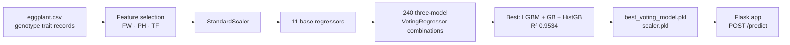

<div align="center">

# Solara

**Ensemble machine learning for eggplant yield prediction**


</div>

---

## Overview

Solara predicts **yield per plant (YPP)** for eggplant genotypes from three cheap,
field-measurable traits — no lab equipment, no soil assay. A grower measures fruit
weight, plant height and total fruit count, and gets a yield estimate.

The core of the project is a search over **240 three-model voting ensembles** built from
11 base regressors. Rather than assuming a single model wins, every combination is trained
and scored, and the best is shipped as a Flask app.

## Results

All 240 combinations were evaluated on a held-out test split. Top performers:

| Rank | Ensemble | R² | MSE | MAE |
|:--|:--|:--|:--|:--|
| 1 | **LightGBM + Gradient Boosting + HistGradientBoosting** | **0.9534** | 0.2857 | 0.3605 |
| 2 | CatBoost + Gradient Boosting + HistGradientBoosting | 0.9529 | 0.2889 | 0.3813 |
| 3 | Gradient Boosting + HistGradientBoosting + K-Nearest Neighbors | 0.9518 | 0.2958 | 0.4055 |
| 4 | Gradient Boosting + HistGradientBoosting + Decision Tree | 0.9471 | 0.3247 | 0.3930 |
| 5 | Random Forest + Gradient Boosting + HistGradientBoosting | 0.9469 | 0.3259 | 0.4325 |

The winning ensemble is serialized to `best_voting_model.pkl` and served by the web app.

> Gradient Boosting and HistGradientBoosting appear in every one of the top five — the
> boosting pair carries the signal, and the third slot mostly trades variance for bias.

## Pipeline



### Base regressors searched

`XGBoost` · `LightGBM` · `CatBoost` · `Kernel Ridge` · `Gradient Boosting` ·
`Random Forest` · `SVR` · `K-Nearest Neighbors` · `Decision Tree` ·
`HistGradientBoosting` · `Multi-layer Perceptron`

## Dataset

`eggplant.csv` — trait measurements across eggplant genotypes (BARI, AC and related lines).

| Column | Meaning |
|:--|:--|
| `Genotypes`, `Gid` | Genotype identity |
| `DFF` | Days to first flowering |
| `FD`, `FL`, `FW` | Fruit diameter, length, weight |
| `NDVI` | Normalized difference vegetation index |
| `PH` | Plant height |
| `SLA`, `SPAD` | Specific leaf area, chlorophyll index |
| `TF` | Total fruits per plant |
| `YPP` | **Yield per plant — the prediction target** |

The deployed model uses **`FW`, `PH` and `TF`** as inputs; the remaining columns are
explored during analysis.

## Quick start

```bash
git clone https://github.com/Asik-Ifthaker-Hamim/Solara.git
cd Solara
pip install -r requirements.txt
python app.py
```

Open http://127.0.0.1:5000 and enter fruit weight, plant height and total fruits.

To reproduce the model search, run `eggplant_voting_ensemble.ipynb` end to end. It
regenerates `best_voting_model.pkl` and `scaler.pkl`.

## Repository layout

```
app.py                          Flask server — routes and prediction endpoint
eggplant_voting_ensemble.ipynb  EDA, base models, 240-combination ensemble search
eggplant.csv                    Trait dataset
best_voting_model.pkl           Serialized winning VotingRegressor
scaler.pkl                      StandardScaler fitted on the training split
templates/                      welcome · home · after · research · description
static/                         Assets
```

## Related research

This work sits alongside my published crop-yield research:

- **Advances in Machine Learning for Crop Yield Prediction: A Comprehensive Review of
  Techniques, Trends, and Challenges** — IEEE ECCE 2025 ·
  [`10.1109/ECCE64574.2025.11013031`](https://doi.org/10.1109/ECCE64574.2025.11013031)
- **NobleMeta: A Noble Technique to Predict Potato Crop Yields in Bangladesh** —
  ACM ICCA 2024 · [`10.1145/3723178.3723255`](https://doi.org/10.1145/3723178.3723255)

## Author

**A.M. Asik Ifthaker Hamim** — Associate AI Engineer, Liberate Labs
[Portfolio](https://asik-ifthaker-hamim.netlify.app/) ·
[Google Scholar](https://scholar.google.com/citations?hl=en&user=0VYBJUsAAAAJ) ·
[ORCiD](https://orcid.org/0009-0006-6361-6277)
